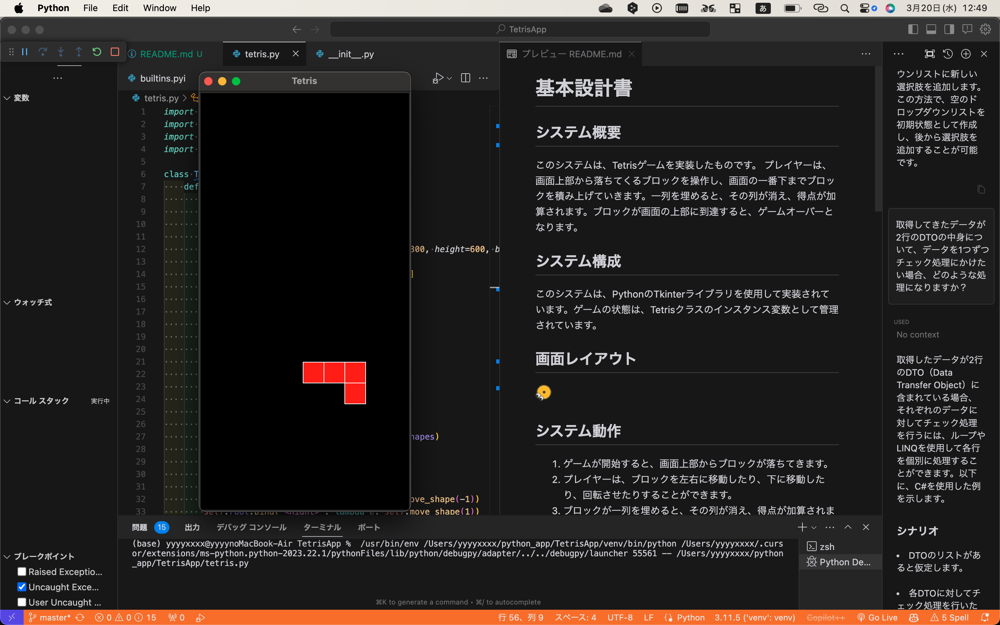
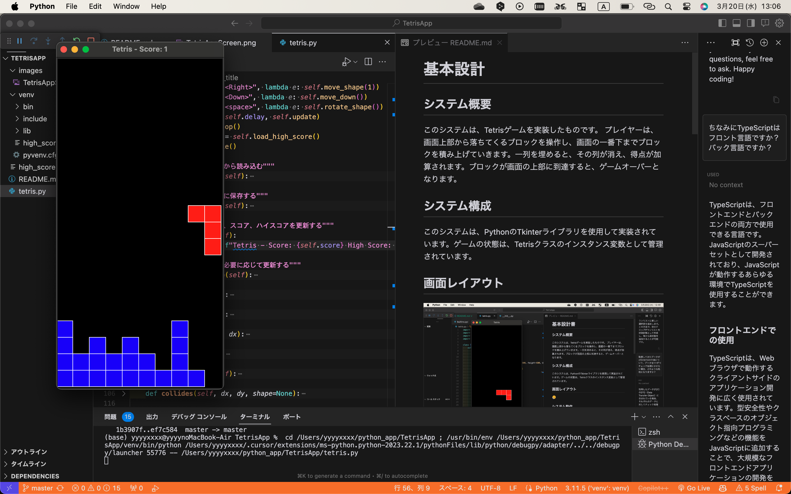
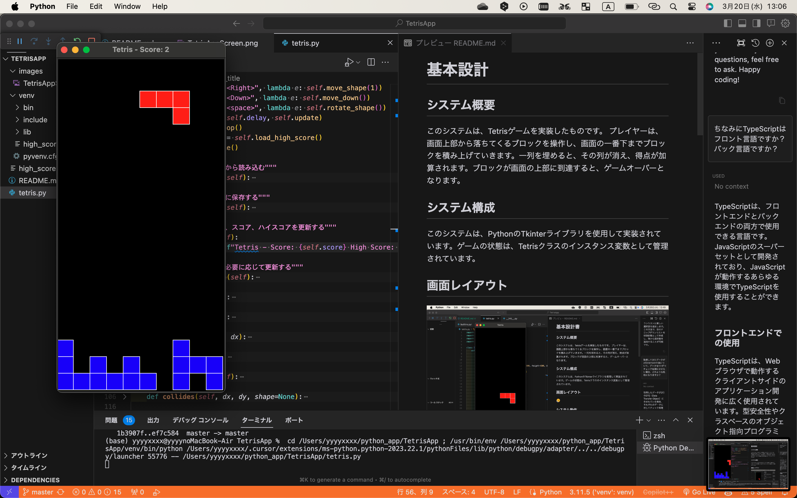
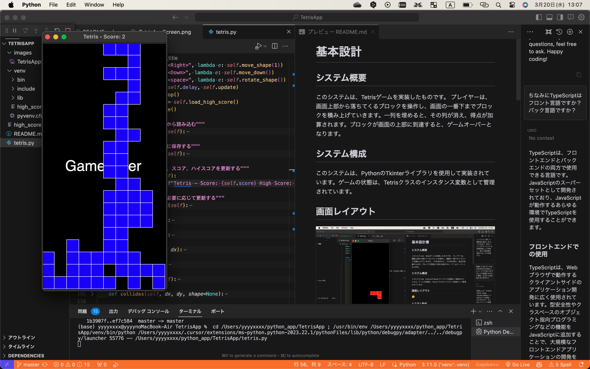

# 基本設計

## システム概要  

このシステムは、Tetrisゲームを実装したものです。  プレイヤーは、画面上部から落ちてくるブロックを操作し、画面の一番下までブロックを積み上げていきます。一列を埋めると、その列が消え、得点が加算されます。ブロックが画面の上部に到達すると、ゲームオーバーとなります。

## システム構成

このシステムは、PythonのTkinterライブラリを使用して実装されています。ゲームの状態は、Tetrisクラスのインスタンス変数として管理されています。

## 画面レイアウト

①ゲームスタート

②横一列にテトリミノが揃うと↓

③その行は消えます

④画面最上部までテトリミノが到達するとGAMEOVER

## システム動作

1. ゲームが開始すると、画面上部からブロックが落ちてきます。
1. プレイヤーは、ブロックを左右に移動したり、下に移動したり、回転させたりすることができます。
1. ブロックが一列を埋めると、その列が消え、得点が加算されます。
1. ブロックが画面の上部に到達すると、ゲームオーバーとなります。  

## 詳細設計

## クラス構成

Tetris: ゲームの状態を管理し、ゲームの動作を制御します。
Block: ブロックの形状と位置を管理します。

### メソッド構成

__init__: ゲームの初期化を行います。ゲームの状態を初期化し、最初のブロックを生成します。  
load_high_score: ハイスコアをファイルから読み込みます。  
save_high_score: ハイスコアをファイルに保存します。
update_title: ウィンドウのタイトル、スコア、ハイスコアを更新します。  
check_high_score: ハイスコアを確認し、必要に応じて更新します。  
draw_board: ボード上のブロックを描画します。  
draw_shape: 現在のブロックを描画します。  
move_shape: ブロックを移動します。  
move_down: ブロックを下に移動します。  
rotate_shape: ブロックを回転します。  
collides: ブロックが他のブロックやボードの境界と衝突していないかをチェックします。  
freeze_shape: ブロックを固定します。  
clear_lines: 消えるべき行を見つけ、それらの行を消します。  
new_shape: 新しいブロックを生成します。  
update: ゲームの状態を更新します。  

## ファイル構成

tetris.py: メインのゲームプログラムです。
high_score.txt: ハイスコアを保存するためのテキストファイルです。
